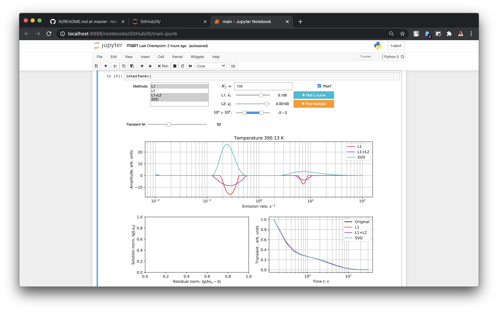

# Inverse the Laplace Transfom using L1 and L2 regression methods

## The point

The point is to determine the decay rate  of the exponential function  using numerical routines for Inverting the Laplace Transform. For exponential continuous function , for <a href="https://www.codecogs.com/eqnedit.php?latex=\inline&space;\text{Re}(s)&space;>&space;0" target="_blank">&space;0" title="\text{Re}(s) > 0" /></a>:

  

## Numerical Laplace Transform

For this, we replace (1) with finite-difference approximation (2) <a href="https://sci-hub.st/https://doi.org/10.1137/0730038">[1]</a>:

where  - discrete approximation of Laplace transform;
 – elements of spectral function, with length ;
 – given transient vector lenght ;
 – normal noise.

<a href="https://www.codecogs.com/eqnedit.php?latex=\inline&space;\mathbf{X}&space;=&space;\left(&space;\begin{array}{cccc}&space;x_{11}&space;&&space;x_{12}&space;&&space;\ldots&space;&&space;x_{1(N_f-1)}\\&space;x_{21}&space;&&space;x_{22}&space;&&space;\ldots&space;&&space;x_{2(N_f-1)}\\&space;\vdots&space;&&space;\vdots&space;&&space;\ddots&space;&&space;\vdots\\&space;x_{(N_F-1)1}&space;&&space;x_{(N_F-1)2}&space;&&space;\ldots&space;&&space;x_{(N_F-1)(N_f-1)}&space;\end{array}&space;\right)" target="_blank"></a>

where 

## The problem

Considering that noise is normal distributed we can maximise the posterior probability and hence minimise the residual sum of squares.  

Since we will fitting the exponential decay with shifted delta function (, for <a href="https://www.codecogs.com/eqnedit.php?latex=\inline&space;\text{Re}(s)>0" target="_blank">0" title="\text{Re}(s)>0" /></a>), and in this model weights  may take zero values.  regression can gives us a sparse solution.

### Result

  

### Papers

1 <a href="https://sci-hub.st/https://doi.org/10.1137/0730038"> A REGULARIZATION METHOD FOR THE NUMERICAL INVERSION OF THE LAPLACE TRANSFORM. CHEN WEI DONG</a>

2 <a href="https://sci-hub.st/https://doi.org/10.1002/cmr.a.21263"> Laplace Inversion of Low-Resolution NMR Relaxometry Data Using Sparse Representation Methods. PAULA BERMAN ET AL.</a>
